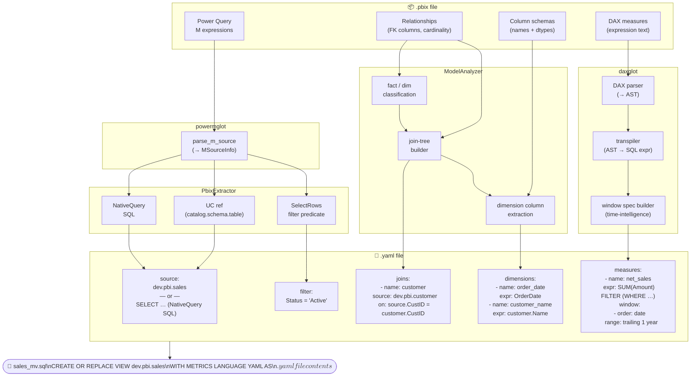

# daxglot / pbi2dbr

A library/cli for converting **PowerBI semantic models** (`.pbix` files) into **Databricks Unity Catalog metric views**.

"Couldn't I just do that with an LLM?".  Yes, you could.

The project is split into four packages:

| Package | Purpose |
|---------|---------|
| `daxglot` | DAX lexer, parser, AST, and SQL transpiler (dialect-aware via [sqlglot](https://github.com/tobymao/sqlglot)) |
| `powermglot` | Power Query M parser and SQL transpiler; exposes `parse_m_source` to extract Unity Catalog table references and filter predicates from M `let…in` expressions |
| `pbi2dbr` | CLI + library that extracts a PBIX model, classifies fact/dimension tables, translates DAX measures to SQL, and emits metric-view YAML and DDL || `measurediff` | Collects metric view measure definitions from Databricks Unity Catalog (with recursive column lineage) and compares them to identify what is the same, different, or equivalent |
| `measurediff` | Extract, Compare & Contrast unity catalog metric view measures including upstream lineage |
---

## Quick start

```bash
# Install
pip install pbi2dbr          # installs daxglot and pbixray automatically

# Convert a PBIX file
pbi2dbr convert \
  --pbix "Adventure Works DW 2020.pbix" \
  --catalog dev \
  --schema pbi \
  --output-dir ./output
```

This writes one `.yaml` + one `_mv.sql` file per detected fact table into `./output/`.

---

## How it works



### 1 — Extraction

`PbixExtractor` wraps [pbixray](https://github.com/jeagleson/pbixray) to pull out:

- **Tables** and their column schemas (names + pandas dtypes)
- **DAX measures** (expression text, display folder, description)
- **Relationships** (from/to table+column, active flag, cardinality)
- **Power Query M expressions** — parsed by `powermglot.parse_m_source` to resolve Unity Catalog references (`catalog.schema.table`), pass-through `NativeQuery` SQL, and `Table.SelectRows` filter predicates

`parse_m_source` handles all common Databricks connector patterns (`Databricks.Catalogs`, `Databricks.Query`, `Value.NativeQuery`, `Sql.Database`) and returns an `MSourceInfo` object:

```python
from powermglot import parse_m_source

info = parse_m_source("""
    let
        Source = Databricks.Catalogs("host", "443", [Catalog="prod"]),
        db = Source{[Name="pbi"]}[Data],
        orders = db{[Name="orders"]}[Data],
        filtered = Table.SelectRows(orders, each [status] = "Active")
    in filtered
""")
# info.source_ref  == "prod.pbi.orders"
# info.filter_sql  == "status = 'Active'"
# info.native_sql  is None
```

When `source_ref` cannot be resolved (e.g. an unsupported connector), `PbixExtractor` falls back to regex-based pattern matching and then to the `--source-catalog` / `--source-schema` defaults.

```python
from pbi2dbr.extractor import PbixExtractor

model = PbixExtractor("Sales Model.pbix").extract(
    source_catalog="dev",   # fallback when M expression can't be resolved
    source_schema="pbi",
)

print(model.tables)                   # ['Sales', 'Customer', 'Date', ...]
print(model.measures[0].expression)  # "= CALCULATE(SUM(Sales[Amount]), ...)"
```

### 2 — Model analysis

`ModelAnalyzer` classifies tables using a heuristic:

- Tables on the **many side** of at least one relationship → **fact table**
- Tables that only appear on the **one side** → **dimension table**
- Tables with measures but no FK relationships → also treated as fact tables

It then builds a star/snowflake **join tree** for each fact table (configurable depth) and extracts dimension columns (FK columns are excluded; joined dim columns are exposed with a `joined_alias.` prefix).

```python
from pbi2dbr.analyzer import AnalysisOptions, ModelAnalyzer

opts = AnalysisOptions(
    fact_tables=["Sales"],          # override heuristic (optional)
    exclude_tables=["_Dates"],      # skip auto-generated date tables
    max_snowflake_depth=3,
)

analyzer = ModelAnalyzer(model, opts)
fact_tables = analyzer.analyze()

for ft in fact_tables:
    print(ft.name, "→", [j.name for j in ft.joins])
# Sales → ['customer', 'product', 'date']
```

### 3 — DAX measure translation

Each DAX measure expression is translated to a SQL aggregate expression by `daxglot`'s `translate_measure()`. The translation covers:

#### Standard aggregations

| DAX | SQL |
|-----|-----|
| `SUM(Sales[Amount])` | `SUM(Amount)` |
| `AVERAGE(Sales[Price])` | `AVG(Price)` |
| `DISTINCTCOUNT(Sales[CustomerID])` | `COUNT(DISTINCT CustomerID)` |
| `COUNTROWS(Sales)` | `COUNT(*)` |

#### Safe division

```dax
= DIVIDE(SUM(Sales[Revenue]), SUM(Sales[Qty]))
```
```sql
SUM(Revenue) / NULLIF(SUM(Qty), 0)
```

#### CALCULATE with filters

```dax
= CALCULATE(SUM(Sales[Amount]), Sales[Status] = "Sold")
```
```sql
SUM(Amount) FILTER (WHERE Status = 'Sold')
```

#### Time-intelligence → window measures

Time-intelligence functions are converted to Databricks metric view **window specs** rather than SQL subqueries:

| DAX function | Window range |
|---|---|
| `SAMEPERIODLASTYEAR(Date[Date])` | `trailing 1 year` |
| `PREVIOUSMONTH(Date[Date])` | `trailing 1 month` |
| `PREVIOUSQUARTER(Date[Date])` | `trailing 1 quarter` |
| `DATEADD(Date[Date], -3, MONTH)` | `trailing 3 month` |
| `DATESYTD(Date[Date])` | `cumulative` + year boundary |
| `TOTALYTD(SUM(...), Date[Date])` | `cumulative` + year boundary |

```dax
= CALCULATE(SUM(Sales[Amount]), SAMEPERIODLASTYEAR('Date'[Date]))
```
```yaml
measures:
  - name: sales_yoy
    expr: SUM(Amount)
    window:
      - order: date
        range: trailing 1 year
        semiadditive: last
```

#### VAR / RETURN blocks

Scalar VARs are inlined before translation:

```dax
= VAR _Numerator = SUM(Sales[Revenue])
  VAR _Denominator = SUM(Sales[Qty])
  RETURN DIVIDE(_Numerator, _Denominator)
```
```sql
SUM(Revenue) / NULLIF(SUM(Qty), 0)
```

#### IFERROR

```dax
= IFERROR(DIVIDE(SUM(A[x]), SUM(B[y])), 0)
```
```sql
COALESCE(SUM(x) / NULLIF(SUM(y), 0), 0)
```

#### SWITCH(TRUE(), …)

```dax
= SWITCH(TRUE,
    Sales[Region] = "West", "Pacific",
    Sales[Region] = "East", "Atlantic",
    "Other")
```
```sql
CASE WHEN Region = 'West' THEN 'Pacific'
     WHEN Region = 'East' THEN 'Atlantic'
     ELSE 'Other' END
```

#### Approximations

Some DAX patterns have no direct SQL equivalent (e.g. `ALLSELECTED`, complex iterator context). These are flagged with `is_approximate = True` and a `-- WARNING` header in the DDL output, so they can be reviewed manually.

### 4 — Output

`MetricViewGenerator` produces two files per fact table.

**`sales.yaml`** — the metric view definition:

```yaml
version: '1.1'
comment: Metric view generated from PowerBI table 'Sales'
source: dev.pbi.sales
joins:
  - name: customer
    source: dev.pbi.customer
    on: source.CustomerID = customer.CustomerID
  - name: product
    source: dev.pbi.product
    on: source.ProductID = product.ProductID
dimensions:
  - name: order_date
    expr: OrderDate
  - name: customer_name
    expr: customer.Name
  - name: product_category
    expr: product.Category
measures:
  - name: Net Sales
    expr: SUM(Amount) FILTER (WHERE Status = 'Sold')
  - name: Net Sales PM
    expr: SUM(Amount) FILTER (WHERE Status = 'Sold')
    window:
      - order: date
        range: trailing 1 month
        semiadditive: last
```

**`sales_mv.sql`** — the DDL statement:

```sql
CREATE OR REPLACE VIEW `dev`.`pbi`.`sales`
WITH METRICS
LANGUAGE YAML
AS
$$
version: '1.1'
source: dev.pbi.sales
...
$$
```

---

## CLI reference

### `pbi2dbr convert`

```
Usage: pbi2dbr convert [OPTIONS]

  Convert a PBIX file to Databricks metric view YAML and SQL DDL files.

Options:
  --pbix PATH              Path to the .pbix file.  [required]
  --catalog TEXT           Target Unity Catalog catalog name.  [required]
  --schema TEXT            Target Unity Catalog schema name.  [required]
  --output-dir PATH        Directory to write output files.  [default: ./output]
  --fact-tables TEXT       Comma-separated list of tables to treat as facts.
  --prefix TEXT            Prefix for generated view names.
  --source-catalog TEXT    Fallback source catalog (when M expr unresolvable).
  --source-schema TEXT     Fallback source schema.
  --exclude-tables TEXT    Comma-separated list of tables to skip.
  --include-isolated       Include tables with no relationships or measures.
  --dialect TEXT           SQL dialect for expressions.  [default: databricks]
```

Example — convert with explicit fact tables and a naming prefix:

```bash
pbi2dbr convert \
  --pbix "Sales Model.pbix" \
  --catalog prod \
  --schema pbi_views \
  --fact-tables "Sales,Returns" \
  --prefix "pbi_" \
  --source-catalog raw \
  --source-schema sales_raw \
  --output-dir ./metric_views
```

### `pbi2dbr inspect`

Explore a PBIX file before converting it:

```bash
# Show tables and column schemas
pbi2dbr inspect --pbix "Sales Model.pbix" --tables

# Show all DAX measures
pbi2dbr inspect --pbix "Sales Model.pbix" --measures

# Show active relationships
pbi2dbr inspect --pbix "Sales Model.pbix" --relationships

# Show everything
pbi2dbr inspect --pbix "Sales Model.pbix" --all
```

---

## Python API

```python
from pbi2dbr.extractor import PbixExtractor
from pbi2dbr.analyzer import AnalysisOptions, ModelAnalyzer
from pbi2dbr.generator import MetricViewGenerator

# 1. Extract
model = PbixExtractor("Sales Model.pbix").extract(
    source_catalog="dev", source_schema="pbi"
)

# 2. Analyse
facts = ModelAnalyzer(
    model,
    AnalysisOptions(exclude_tables=["_Dates"]),
).analyze()

# 3. Generate
gen = MetricViewGenerator()
for fact in facts:
    spec = gen.build_spec(fact, target_catalog="dev", target_schema="pbi")
    yaml_path, sql_path = gen.write(spec, output_dir="./output")
    print(f"Wrote {yaml_path} and {sql_path}")
```

Translate a single DAX expression directly:

```python
from daxglot.measure_translator import translate_measure

result = translate_measure(
    "= CALCULATE(SUM(Sales[Amount]), SAMEPERIODLASTYEAR('Date'[Date]))"
)
print(result.sql_expr)      # SUM(Amount)
print(result.window_spec)   # [WindowSpec(order='date', range='trailing 1 year', ...)]
print(result.warnings)      # []
```

---

## Project structure

```
daxglot/                  # core DAX→SQL library
  tokens.py               # lexer
  parser.py               # recursive-descent parser → AST
  ast_nodes.py            # frozen dataclass AST node types
  transpiler.py           # AST → sqlglot expression tree
  measure_translator.py   # high-level DAX measure → SQL + window spec

powermglot/               # Power Query M parser and SQL transpiler
  powermglot/
    lexer.py              # M tokeniser
    parser.py             # recursive-descent M parser → AST
    ast_nodes.py          # M AST node types
    transpiler.py         # AST → SQL (m_to_sql, parse_m_source, MSourceInfo)

pbi2dbr/                  # PBIX conversion library + CLI
  pbi2dbr/
    models.py             # SemanticModel, FactTable, MetricViewSpec, …
    extractor.py          # PBIX → SemanticModel (via pbixray + powermglot)
    analyzer.py           # fact/dim classification, join-tree building
    translator.py         # DAX measures → Measure objects (wraps daxglot)
    generator.py          # MetricViewSpec → YAML + SQL DDL
    cli.py                # `pbi2dbr convert` / `pbi2dbr inspect` commands

tests/
  unit/
    test_daxparser.py
    test_measure_translator.py

pbi2dbr/tests/
  test_analyzer.py
  test_extractor.py
  test_generator.py
  test_integration.py     # end-to-end tests against real .pbix files

measurediff/              # Unity Catalog metric view collection + diffing
  measurediff/
    models.py             # LineageColumn, MeasureDefinition, MetricViewDefinition, …
    collector.py          # discover metric views + fetch DDL via Spark
    extractor.py          # parse metric view DDL and SQL expressions (no Spark)
    lineage.py            # recursive lineage enrichment from system.access.column_lineage
    serializer.py         # write per-measure YAML files
    loader.py             # read per-measure YAML files back into models
    comparator.py         # expression / window / lineage comparison + similarity score
    display.py            # rich terminal diff renderer
    cli.py                # `measurediff collect` / `measurediff diff` commands
  tests/unit/
    test_extractor.py
    test_models.py
    test_serializer.py
    test_comparator.py
```

---

## measurediff

`measurediff` has two responsibilities: **collecting** measure definitions from live Databricks metric views (enriched with recursive column lineage from `system.access.column_lineage`), and **diffing** any two collected measures to understand how similar or different they are.

### Collect

Discovers metric views, parses their YAML definitions, traverses upstream column lineage, and writes one YAML file per measure.

```bash
# Collect all metric views in a catalog/schema (with lineage)
measurediff collect --catalog prod --schema finance -o ./definitions

# Skip lineage for speed
measurediff collect --catalog prod --schema finance --no-lineage -o ./definitions
```

Each output file is named `{catalog}.{schema}.{view}.{measure}.yaml` and contains the measure expression, optional window specs, and a recursive lineage tree showing how every referenced column flows from its ultimate source table:

```yaml
metric_view: prod.finance.sales_metrics
name: Monthly_Sales
expr: SUM(source.total)
window:
  - order: date
    range: trailing 1 months
    semiadditive: last
lineage:
  - table: prod.finance.sales
    column: total
    type: UNKNOWN
    upstream:
      - table: prod.raw.orders
        column: total
        type: TABLE
```

### Diff

Compares two collected measure files across three dimensions:

| Dimension | Weight | How it's measured |
|-----------|--------|--------------------|
| **Expression** | 50% | SQL expressions are normalized (table qualifiers stripped via sqlglot) before comparison |
| **Window specs** | 20% | Each window field (`order`, `range`, `semiadditive`) compared independently |
| **Lineage** | 30% | Jaccard similarity of ultimate *leaf* source columns; intermediate hops are flagged separately rather than penalised |

A weighted score produces one of three labels: **Identical** (≥ 98%), **Similar** (≥ 60%), or **Different** (< 60%).

```bash
measurediff diff \
  playground.bravo.country_sales.Monthly_Sales.yaml \
  playground.charlie.alphasales.MonthSales.yaml
```

```
╭──────────────────────────── Measure Diff ────────────────────────────╮
│ A                                   B                                │
│ playground.bravo.country_sales      playground.charlie.alphasales    │
│ Monthly_Sales                       MonthSales                       │
╰──────────────────────────────────────────────────────────────────────╯
╭── Similarity ──╮
│ Similar  93.3% │
╰────────────────╯
╭─────────────────── Expression  ✓ ───────────────────╮
│ SUM(source.total)                                   │
╰─────────────────────────────────────────────────────╯
╭─────────────────── Window  ✗ ───────────────────────╮
│  Spec  Field         A                  B        ✓/✗ │
│  [0]   order         date               date      ✓  │
│  [0]   range         trailing 1 months  trailing  ✗  │
│                                         30 days      │
│  [0]   semiadditive  last               last      ✓  │
╰─────────────────────────────────────────────────────╯
╭─────────────── Lineage (leaf sources)  ✓ ───────────╮
│  Source                   Column  In A  In B         │
│  playground.alpha.sales   total    ✓     ✓           │
│  ⚠ A has extra intermediate hops                    │
╰─────────────────────────────────────────────────────╯
```

The extra-hop warning means `Monthly_Sales` routes through `playground.bravo.sales` on its way to the same ultimate source — functionally equivalent, but the lineage path is longer.

---

## Limitations and notes

- **Measure references** — DAX measures that call other measures (e.g. `[Net Sales PM]`) are translated as plain column references. Full composability via `MEASURE(name)` is applied where the referenced measure was already translated in the same view.
- **Row context / iterators** — `SUMX`, `AVERAGEX` and other iterator functions are approximated with their scalar aggregate equivalent and flagged as approximate.
- **Complex filter context** — `ALL()`, `ALLSELECTED()`, and `KEEPFILTERS()` modifiers inside `CALCULATE()` drop the context modifier and emit a warning; the base aggregate is still emitted.
- **Auto date tables** — PowerBI generates hidden `DateTableTemplate_*` and `LocalDateTable_*` tables. These are typically dimension tables and will not be classified as fact tables. Use `--exclude-tables` to suppress them entirely.
- **Unity Catalog resolution** — Power Query M expressions are parsed for Databricks catalog references (`DatabricksCatalog.Contents`, `Databricks.Catalogs`, `NativeQuery` patterns). If a table's M expression cannot be parsed, `--source-catalog` / `--source-schema` provide a fallback.
